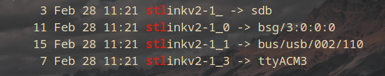

# STM32f42xxx_SerialPort

## How to use it ?


The first step is of course to initialise the device by calling the function **SERIAL_PORT_Init()**. After this step you can of course move on to a possible visualisation.

To see the values that are sent via SPI to the **VCP** (**V**irtual **C**OM **P**ort)
you kann use **PuTTY** on Windows and **screen** on Linux.
PuTTY is also available on Linux :wink: .
### Unix/Linux OS
You simply have to enter the command ``` screen /dev/ttyACMx 115200 ```.
The x must be replaced here, as the port connections are dependent on the computer.
You then end up in the serial monitor where the values are output in an endless loop.
To find out which serial line your microcontroller is connected to you can enter the command ``` ls -l /dev ```.

 

### Windows OS
First you had to find the __Serial line__ that corresponds to your Microcontroller. This configuration is usually accessible under Windows in "Device Manager" in the __Port__ section then you open the **PuTTY** program enter the configurations as shown in the picture below and you are done!

 

